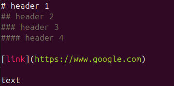
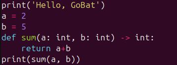

# GoBat
A clone of cat(1) with wings. Ported to Golang.

## Links to the original project
**🔸GoBat is a rewritten version of [bat](https://github.com/sharkdp/bat) in Go — a syntax highlighting utility.**

**🔸The original project was developed by [sharkdp](https://github.com/sharkdp)**

**❗ The original project was written in the Rust programming language, I decided to make my own fork of this project in the Go programming language.**

**Since this is a fork of a project rewritten from Rust to Go, the internal implementation and documentation will differ. Since the original project has MIT and Apache licenses, I have full right to change the internal components of the project, with the exception of licenses and mentions of the author. The link to the original documentation can be found here, as well as in the docs/ directory. (At this stage of development, you will not find links to the original documentation in the /docs directory, but you can find it below.)**

🔹 [Original documentation](https://github.com/sharkdp/bat/tree/master/doc) \
🔹 [Original readme](https://github.com/sharkdp/bat/blob/master/README.md)

## Project version and status
* **Current version:** v0.9.0 (beta) 
* **Project status:** in development... 
* **Languages:** Go | Golang 1.24.2 
* **Tested on:** Ubuntu 24.04

## Features
### Syntax highlighting
GoBat supports syntax highlighting for many programming and markup languages.




## Installation and launch
```
git clone https://github.com/wnderbin/go-bat # clone the repository and go to the project directory
cd go-bat
go build # compilation of the project
./go-bat # instructions for use
./go-bat README.md # view README.md file
```
